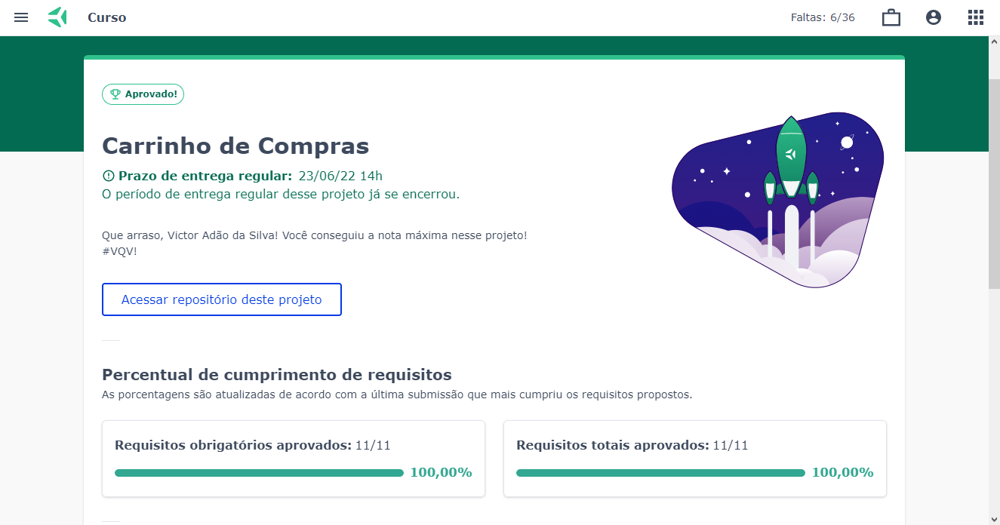

# Projeto Shopping Cart


Esse projeto foi muito booom, me diverti e aprendi bastante com ele


🔰Como iniciar o projeto na sua máquina🔰

- ``` git clone git@github.com:VictorSilva27/Projeto-Shopping-Cart.git ``` (Clonar o repositório no local)
- ``` cd Projeto-Shopping-Cart ``` (Entrar no repositório clonado)
- Inicie pelo Live Server [(Extensão do VS Code)](https://marketplace.visualstudio.com/items?itemName=ritwickdey.LiveServer)

### Nota do Projeto

